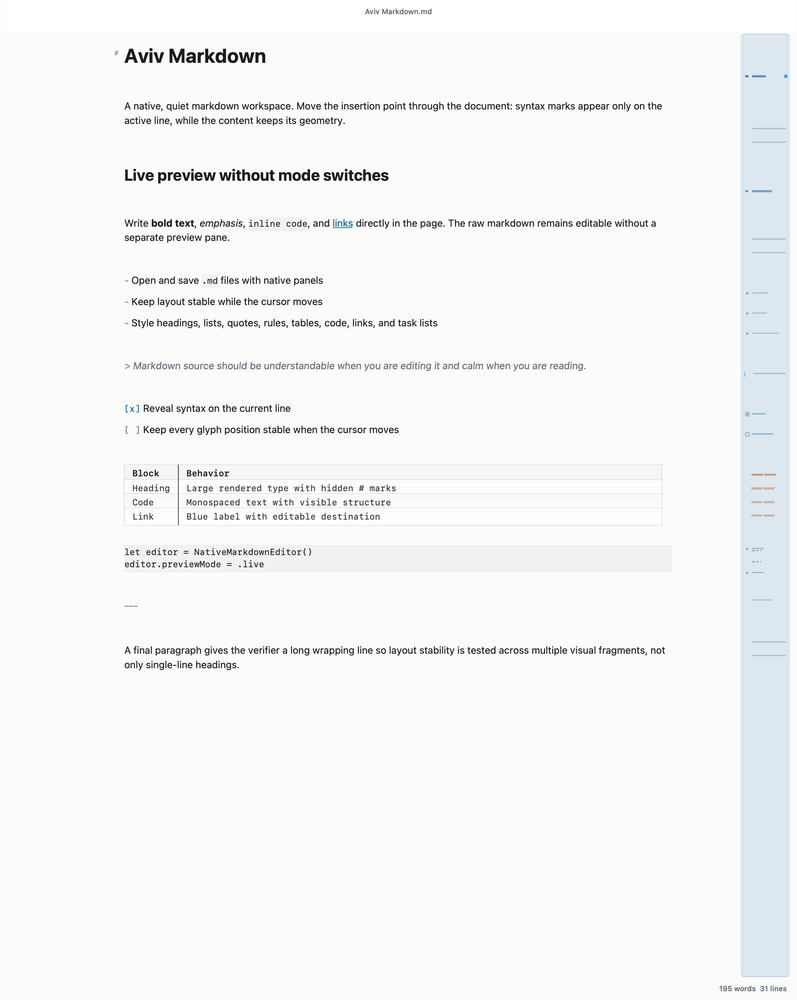
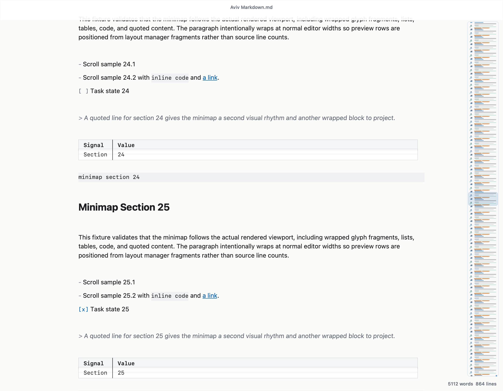

# Aviv Markdown ✨

**Aviv is a hyper-clean native macOS and Windows Markdown editor with a calm WYSIWYG writing surface.**

It is built for people who want Markdown files, native speed, and a focused document feel without the usual split preview/source editor clutter. You write real `.md` files, but Aviv renders them inline so the page feels quiet, minimal, and direct.

Aviv is deliberately lightweight: the full native app can sit around **80 MB of RAM** while working on a document, and it scales CPU back to **0% when idle or in the background**. That means it has essentially no ongoing laptop-battery tax while you keep it open beside browsers, IDEs, terminals, chat, and research tools.

This is the source code repo. For convenient installer downloads, use the Aviv download page:

**Download Aviv installers:** https://pitchai.net/aviv-editor/

- macOS DMG
- Windows x64 ZIP



## Why Aviv? 🌿

Most Markdown editors make you choose between raw source and rendered preview. Aviv aims for the sweet spot:

- **WYSIWYG-style Markdown editing** without giving up the underlying plain-text `.md` file.
- **No split preview pane** and no mode switcher.
- **Stable layout while editing** so content does not jump when the cursor moves.
- **Native AppKit macOS app** and **native WinUI 3 Windows app** instead of Electron.
- **Minimal, glassy, readable UI** with subtle frosted top and minimap surfaces.
- **Hyper-lightweight runtime** around 80 MB RAM in normal document work, with idle/background CPU returning to 0%.

## Features 🚀

- Live rendered Markdown in one editable surface.
- Smart syntax reveal on the active line.
- Headings, bold, italic, code, links, local image attachments, blockquotes, rules, tables, task lists, and fenced code.
- Native open/save panels for `.md` files.
- Multiple windows and native macOS document tabs.
- `Cmd-T` for a new tab, `Cmd-W` to close the active tab/window.
- Drag tabs out into new windows and merge windows back together.
- Clean minimap/sidebar that follows the actual rendered viewport.
- Top bar and sidebar use subtle blur/tint so overlays stay readable.
- A native bottom-left format selector for a focused blog-width view or wider A4 document view.
- A4-aware printing that avoids double-padding the editor and the paper margins.
- Zoom controls that change view size without changing Markdown source.
- Native print and page setup support.
- Optional native prompt to make Aviv the default app for opening Markdown files, with a never-show-again choice.
- Command, tab, layout, and minimap verifiers for regression testing.

## Screenshots 🖼️



## Install Locally 🛠️

Aviv is a Swift Package app targeting macOS.

```bash
swift run Aviv
```

To package and install it as the default Markdown handler:

```bash
Scripts/install_default_markdown_handler.sh
```

That builds `dist/Aviv.app`, installs it to `/Applications` when possible, signs it ad hoc, registers it with LaunchServices, and makes it the default app for Markdown files.

To build a downloadable macOS disk image:

```bash
Scripts/package_dmg.sh
```

That creates `dist/Aviv-Editor-macOS.dmg` plus a SHA-256 checksum file.

## Verification ✅

Run the complete verification suite:

```bash
Scripts/run_ui_verification.sh
```

This runs:

- Swift unit tests
- command/menu verifier
- tab/window verifier
- layout stability verifier
- minimap viewport verifier
- rendered snapshot generation

Core invariants are tested directly: moving the cursor should not shift rendered content, the minimap should track the real scroll viewport, and native tabs/windows should behave like real macOS document tabs.

## Project Shape 🧱

```text
Sources/AvivApp      macOS app shell, menus, windows, tabs, packaging verifiers
Sources/AvivCore     editor view, Markdown styling, minimap, parsing, snapshots
Tests/AvivCoreTests  layout, minimap, edge-case, command, and styling tests
Windows              native WinUI 3 Windows app, shared C# core, tests, publish scripts
Scripts              packaging, LaunchServices install, verification scripts
Docs                 design notes and regression checklists
Samples              sample Markdown fixtures
```

## Philosophy 🧘

Aviv is intentionally quiet. Markdown remains editable source, but the visual surface is designed for reading and writing rather than inspecting syntax all day.

The editor should feel:

- **fast**
- **native**
- **minimal**
- **stable**
- **beautifully boring when you are focused**

## License

Aviv is open source under the MIT license.
